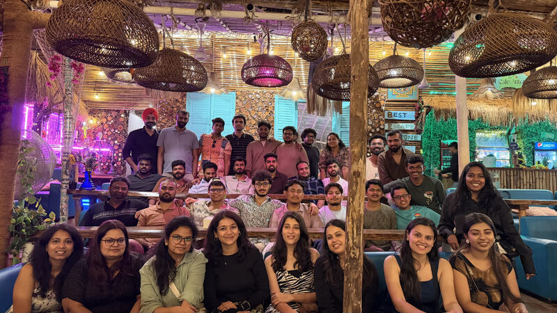

If you ask different people at Emitrr what the engineering culture looks like, you’ll probably get slightly different answers. And that’s expected.

Because the culture here wasn’t designed in a document or defined through a list of values on a slide. It evolved naturally from how people work together every day.

Emitrr has always been a remote company. Most of our collaboration happens through Slack threads and calls. Over time, you start forming an image of your coworkers through these interactions. Someone might seem very serious in meetings. Someone else might appear quiet on Slack.

And sometimes that image turns out to be very different in person.

That’s why our annual offsite is always special. For many of us, it’s the first time meeting teammates after months of working together remotely. No presentations, no long agendas — just people spending time together outside work.

Interestingly, even when you meet a teammate in person for the first time after months of working together, it rarely feels like meeting a stranger. In many cases it feels more like meeting someone you’ve already known for years — because you’ve already shared context, solved problems together, and built that connection through work.

But the offsite is only a small reflection of something bigger: how people work together at Emitrr every day.

<blockquote class="quote-title">Engineers Work for Customers, Not for Titles</blockquote>

One of the biggest differences people notice when they join Emitrr is how ownership works.

Engineering here is not limited to writing code or pushing commits to a repository. Engineers are expected to think about the full lifecycle of a problem.

It often starts with understanding what the customer actually needs. From there the engineer might design the solution, build it, deploy it, and observe how it behaves in production.

Shipping code is not the end of the process.

The real goal is making sure the customer actually finds value in what was built.

This mindset takes time to adjust to for people coming from environments where roles are more narrowly defined. But once engineers experience it, many find it far more meaningful. Instead of completing isolated tasks, they are solving real problems.

<blockquote class="quote-title">The Kind of Problems We Solve at Emitrr</blockquote>

At Emitrr, our engineering work revolves around building communication infrastructure for healthcare practices — handling real-time messaging, workflow automation, integrations with healthcare systems like athenahealth, and AI-driven patient communication.

For example, imagine we are building a workflow automation feature for healthcare practices.

An engineer’s work often begins by collaborating with stakeholders and customers to understand the real problem behind a request. Instead of jumping straight to implementation, engineers spend time understanding how clinics currently handle these processes and where the friction exists.

From there, the engineer helps explore possible solutions — thinking through different approaches, evaluating trade-offs, and designing a system that solves the problem in a reliable way.

Once the direction is clear, the work continues through the entire lifecycle:

- &nbsp; designing the architecture

- &nbsp; building the feature

- &nbsp; deploying it to production

- &nbsp; monitoring how it behaves in real environments

- &nbsp; observing whether it actually solves the customer’s problem

Often the first version of a solution reveals new insights. Engineers then iterate — refining the product, improving reliability, and adapting the system based on real-world usage.

In this way, engineers at Emitrr are not simply implementing tasks from a ticket queue. They work closer to product owners — thinking deeply about the problem, the solution, and the long-term impact on customers.

Over time, this way of working naturally builds a strong sense of ownership.

<blockquote class="quote-title">Trust Instead of Rules</blockquote>

Many companies try to define culture through rules, policies, and structured processes.

Emitrr has taken a different approach.

Rather than building systems around the assumption that someone might misuse them, the focus is on working with people who respect a culture of responsibility and ownership.

This naturally leads to fewer rigid policies around how work should happen. People are trusted to manage their time and responsibilities in a way that works best for them and the team.

When people operate with that level of trust, they tend to take their work more seriously.

<blockquote class="quote-title">Everyone Knows What’s Really Happening</blockquote>

Another important part of the culture at Emitrr is transparency.

People across the team generally understand why the company is building certain things, where we are succeeding, and where we are struggling.

Wins are visible, but so are failures.

This transparency creates a shared understanding of priorities. Engineers are not just solving isolated technical problems — they understand the larger context behind those problems.

When people know the difference between what is urgent and what is truly important, better decisions follow naturally.

<blockquote class="quote-title">Mistakes Are Expected, Learning Is Required</blockquote>

Building software means things will break. Systems fail. Assumptions turn out to be wrong.

At Emitrr, the expectation isn’t that mistakes will never happen.

The expectation is that we learn from them.

When something goes wrong, the first question usually isn’t:

“Who did this?”

It’s:

“How did this happen, and how can we improve the system so it doesn’t happen again?”

Often the answer reveals a missing process, a weak system, or a better way of doing things.

Over time, those lessons make the system stronger.

<blockquote class="quote-title">Authenticity Over Performance</blockquote>

In many workplaces people feel pressure to maintain a “professional version” of themselves.

Emitrr has generally tried to avoid that.

People are encouraged to be authentic, respectful, and honest in how they communicate and collaborate.

When people feel safe sharing ideas, admitting mistakes, or asking questions, better work tends to follow.

It also creates stronger relationships across the team — something that matters even more in a remote environment.

<blockquote class="quote-title">Culture Shows Up in the Small Things</blockquote>

Culture isn’t defined through slogans or value statements. At Emitrr, it shows up in everyday behaviors.

It shows up when engineers stay involved until a customer’s problem is truly solved.

It shows up when people openly share what worked and what didn’t.

It shows up when teammates help each other without worrying about roles or boundaries.

Over time, these small actions define how work actually happens.

**At Emitrr, engineering culture is simply how we build — taking ownership, learning from mistakes, and staying focused on solving real problems for customers.**

· · ·

Emitrr is growing and we’re always excited to meet engineers who care deeply about ownership, solving real customer problems, and building systems that matter.

If this culture resonates with you, we’d love to talk.

**See open roles:** [careers link](https://www.linkedin.com/company/emitrr/)
